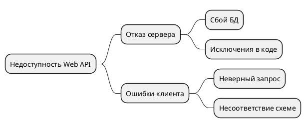

## Анализ рисков
### Технические риски:
- **Отказ базы данных:** Потеря доступа к PostgreSQL может вызвать полную недоступность сервиса. 
	- Необходимо предусмотреть резервные копии, репликацию и отказоустойчивую архитектуру.
- **Уязвимости в безопасности:** Возможны атаки из-за отсутствия HTTPS, неправильной настройки CORS или уязвимости JWT. 
	- Требуется настройка HTTPS, защита токенов и внедрение шифрования.
- **Недостаточное логирование и обработка ошибок:** Затрудняет поиск и устранение проблем. 
	- Сделать логирование.
- **Неправильные миграции базы данных:** Ошибки при обновлении схемы могут повредить данные. 
	- Нужно использовать миграции с проверкой и возможностью отката.

### Человеческие риски:
- **Ошибки разработчика:** Могут привести к серьёзным сбоям

## SWOT-анализ

**S (Сильные стороны)**
- Простая архитектура, легко масштабируется
- JWT-аутентификация обеспечивает безопасность
- Возможность быстрого деплоя и расширения

**W (Слабые стороны)**
- Отсутствие полноценного тестирования
- Ограниченное логирование
- Отсутствие CI/CD

**O (Возможности)**
- Интеграция с внешними сервисами
- Миграция на микросервисы
- Автоматизация тестирования и деплоя

**T (Угрозы)**
- Атаки на безопасность (SQL-инъекции, XSS)
- Человеческий фактор в коде и деплое
- Потеря данных из-за сбоев БД

## FMEA-анализ

| Компонент       | Потенциальный отказ    | Причина                           | Последствия                 | Меры минимизации                          |
| --------------- | ---------------------- | --------------------------------- | --------------------------- | ----------------------------------------- |
| База данных     | Потеря соединения      | Перезагрузка, ошибка конфигурации | API не отвечает             | Репликация, резервное копирование         |
| Авторизация     | Утечка токенов         | Ошибки в конфигурации             | Нарушение безопасности      | HTTPS, защита хранилища, ротация ключей   |
| Контроллеры API | Исключения на запросах | Отсутствие валидации входа        | 500-е ошибки пользователям  | DTO, валидация, unit-тесты                |
| Миграции        | Потеря данных          | Ошибочная миграция схемы          | Нарушение логики работы API | Ручная проверка миграций, резервные копии |

## FTA-анализ

### Меры предотвращения:
- Централизованная обработка исключений
- Проверка схемы данных (DTO)
- Бэкапы и репликация БД