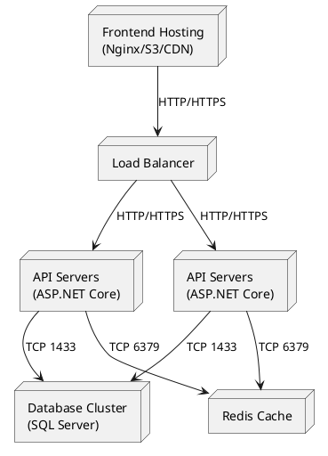
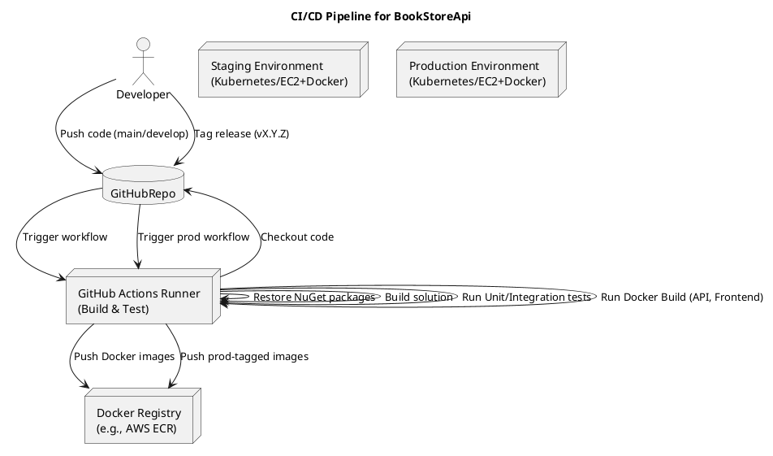

## 1. Схема развёртывания (Deployment Diagram)


**Описание диаграммы:**

- **Load Balancer (LB):**
    - Принимает входящий HTTP/HTTPS-трафик от пользователей (например, внешний DNS указывает на LB).
    - Распределяет запросы между несколькими копиями API-сервиса (горизонтальное масштабирование).
- **API Servers (API1, API2):**
    - Запущены в контейнерах Docker на виртуальных машинах.
    - Каждый экземпляр слушает порт `5000`/`443` (конфиг HTTPS), обрабатывает запросы к `BookStoreApi`.
    - Подключаются к центральной базе данных и кешу Redis.
- **Database Cluster (DB):**
    - Высокодоступный кластер PostgreSQL
    - Настроены регулярные бэкапы (daily snapshots) и Multi-AZ (для отказоустойчивости).

- **Redis Cache:**
    - Используется для кэширования наиболее частых запросов
- **Frontend Hosting (FE):**
    - Статически собрать SPA (React) → залить в S3 (или другое хранилище) → раздать через CDN (CloudFront).
    - Поддерживает HTTPS, кэширование на уровне CDN.

## 2. План работ по развёртыванию

### 1. Оценка инфраструктуры и выбор окружений

1. **Окружения:**
    - **Development** (локальный компьютер + докер):
        - Для разработчиков, быстрого тестирования.
        - Минимальный стек: Docker Compose (API + БД).
    - **Staging/Test** (в облаке или виртуальной среде):
        - Полная имитация продакшена: Load Balancer → 2×API → DB → Redis → CDN
    - **Production** (облако/в дата-центре заказчика):
        - Широкий доступ, высокая нагрузка, возможность авто-масштабирования.
2. **Пропускная способность и ресурсы:**
    - Выделить ресурсы:
        - Серверы для API.
        - Размер БД
        - Redis
3. **Сеть и безопасность:**
    - Создать VPC с подсетями (public для Load Balancer, private — для API, БД, Redis).
    - Подключение API и БД в private-сети (нет прямого доступа из интернета).
    - Frontend хостится через S3 + CloudFront.

### 2. Настройка CI/CD



- **Trigger (push/PR):**
    - При пуше в ветку `develop` → CI запускает сборку и деплой в **Staging**.
    - При создании тегов `vX.Y.Z` или мердже в `main` → CI деплоит в **Production**.
- **Build & Test:**
    - В workflow (GitHub Actions) шаги:
        1. Checkout кода.
        2. `dotnet restore` → `dotnet build` → `dotnet test` (Unit + Integration, In-Memory/SQLite).
        3. Сборка Docker-образа для Backend

## 3. Миграции данных

1. **DbInitializer**
    - При первом запуске API проверяем, пустая ли таблица `Users`.
    - Если пусто - создаём админа по умолчанию.
    - Наполняем тестовыми данными.
        
2. **Миграции EF Core**
``` bash
dotnet ef migrations add InitialCreate
dotnet ef database update
```


