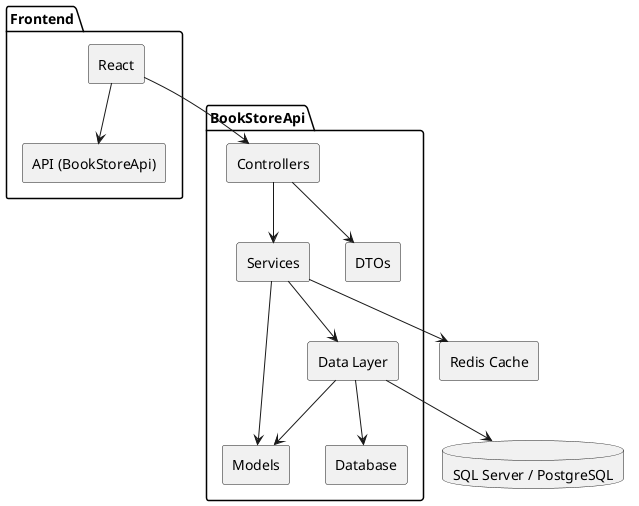
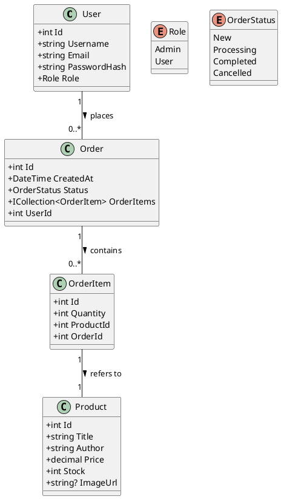

## 1. Архитектурная схема
Ниже приведена **диаграмма компонентов** (Component Diagram), демонстрирующая высокоуровневую архитектуру приложения.

**Описание компонентов:**
- **Controllers**  
    Отвечают за приём HTTP-запросов от клиента, валидацию входящих данных (через DTO), и делегируют бизнес-логику в слой Services.
- **Services**  
    Инкапсулируют бизнес-логику: генерацию JWT, управление заказами, валидацию правил (например, проверка остатка на складе), общие утилиты.
- **Data Layer**  
    Entity Framework Core (Code First). Содержит `AppDbContext`, конфигурацию сущностей, миграции, инициализацию (seed).
- **Models**  
    Доменные сущности (User, Product, Order, OrderItem). Используются как в сервисах, так и в слое данных.
- **DTOs**  
    Простые объекты для обмена данными между клиентом и сервером. Избегают утечки лишних полей (PasswordHash, InternalId и т.п.).
- **Database**  
    Реляционная СУБД (MS SQL Server или PostgreSQL) для хранения пользователей, товаров и заказов.
- **Redis Cache**  
    Опциональный слой кэширования — хранение часто запрашиваемых данных (список товаров, сессии). Используется через библиотеку StackExchange.Redis.
- **Frontend**  
    Одностраничное приложение (React), запрашивает API для отображения каталога, оформления заказов, административной панели.

## 2. Соглашения по коду
### 2.1. Общие правила
1. **Язык и платформа**
    - Бэкенд: C#, .NET 7 (или .NET 6 при необходимости совместимости).
    - Фронтенд: React (TypeScript) / Vue (TypeScript) / Angular — в зависимости от выбранного стека (приоритет React + TypeScript).
2. **Файловая организация**
    - Каждый класс/интерфейс размещается в отдельном файле.
    - Имя файла совпадает с именем класса (например, `ProductController.cs` содержит класс `ProductController`).
    - Пространства имён (namespace) соответствуют структуре папок:

```cpp
BookStoreApi/
├── Controllers/     (namespace BookStoreApi.Controllers)
├── Services/        (namespace BookStoreApi.Services)
├── Data/            (namespace BookStoreApi.Data)
├── Models/          (namespace BookStoreApi.Models)
├── DTOs/            (namespace BookStoreApi.DTOs)
├── Middleware/      (namespace BookStoreApi.Middleware)
├── Enums/           (namespace BookStoreApi.Enums)
└── ...              
```
3. **Именование (Naming Conventions)**
    - **Классы, интерфейсы, enum’ы**: PascalCase.
        - Пример: `UserService`, `IProductRepository`, `OrderStatus`.
    - **Методы, свойства**: PascalCase.
        - Пример: `GetAllProducts()`, `CreateOrder()`, `PasswordHash`.
    - **Поля экземпляра и локальные переменные**: camelCase.
        - Пример: `_dbContext`, `userId`, `orderItems`.
    - **Интерфейсы**: названы с префиксом `I`, например `IUserService`.
4. **Структура методов**
    - **Порядок членов класса:**
        1. Поля (private, readonly)
        2. Свойства (public)
        3. Конструкторы
        4. Публичные методы (public)
        5. Внутренние методы (private/protected)
    - Между блоками следует оставлять пустую строку.
### 2.2 Структура и ключевые пакеты
```cpp
BookStoreApi/
├── BookStoreApi.sln
├── BookStoreApi/
│   ├── Controllers/
│   │   ├── AuthController.cs
│   │   ├── ProductsController.cs
│   │   ├── OrdersController.cs
│   │   └── UsersController.cs
│   ├── DTOs/
│   │   ├── LoginDto.cs
│   │   ├── RegisterDto.cs
│   │   ├── ProductDto.cs
│   │   ├── OrderDto.cs
│   │   ├── OrderItemDto.cs
│   │   └── UpdateOrderStatusDto.cs
│   ├── Models/
│   │   ├── User.cs
│   │   ├── Product.cs
│   │   ├── Order.cs
│   │   └── OrderItem.cs
│   ├── Enums/
│   │   └── OrderStatus.cs
│   ├── Data/
│   │   ├── AppDbContext.cs
│   │   └── DbInitializer.cs
│   ├── Services/
│   │   └── JwtService.cs
│   ├── Middleware/
│   │   └── ExceptionHandlingMiddleware.cs
│   ├── Migrations/
│   ├── appsettings.json
│   ├── appsettings.Development.json
│   ├── Program.cs
│   └── BookStoreApi.csproj
├── BookStoreApi.Tests/
│   ├── BookStoreApi.UnitTests/
│   └── BookStoreApi.IntegrationTests/
└── docker-compose.yml
```
**Основные зависимости (.csproj):**
- `Microsoft.EntityFrameworkCore`
- `Microsoft.EntityFrameworkCore.SqlServer` (или `Npgsql.EntityFrameworkCore.PostgreSQL`)
- `Microsoft.EntityFrameworkCore.Tools` (для миграций)
- `Microsoft.AspNetCore.Authentication.JwtBearer`
- `BCrypt.Net-Next` (для хэширования паролей)
- `Swashbuckle.AspNetCore` (Swagger/OpenAPI)
- `StackExchange.Redis` (при необходимости)
- `xUnit`, `FluentAssertions` (в тестовых проектах)
- `Moq` (для Unit Tests)

## 3. Настройка окружения для разработки
### 3.1. Необходимое ПО
1. **.NET 7 SDK (или .NET 6 SDK)**
2. **Node.js + npm (версия ≥16)** — для сборки фронтенда
3. **Docker & Docker Compose**
4. **Git**
5. **IDE/Editor:** Visual Studio 2022 / VS Code / Rider

### 3.2. Переменные окружения
Для локальной разработки создайте файл `appsettings.Development.json` (он уже есть в репозитории, но при необходимости измените):
```json
{
  "ConnectionStrings": {
    "DefaultConnection": "Server=localhost;Database=BookStoreDb;User Id=sa;Password=Your_Password123;"
  },
  "Jwt": {
    "Key": "Local_Dev_Secret_Key_ChangeMe",
    "Issuer": "BookStoreApi",
    "Audience": "BookStoreApiUsers"
  },
  "Logging": {
    "LogLevel": {
      "Default": "Debug",
      "Microsoft.Hosting.Lifetime": "Information"
    }
  }
}
```

### 3.3 Настройка БД
Локально должен быть доступ к postgreSQL серверу через Docker, установленный локально

## 4. Тестирование

- Тесты находятся в проекте `BookStoreApi.Tests/BookStoreApi.UnitTests/`.
- Используется фреймворк **xUnit**

## 5. Диаграмма классов


